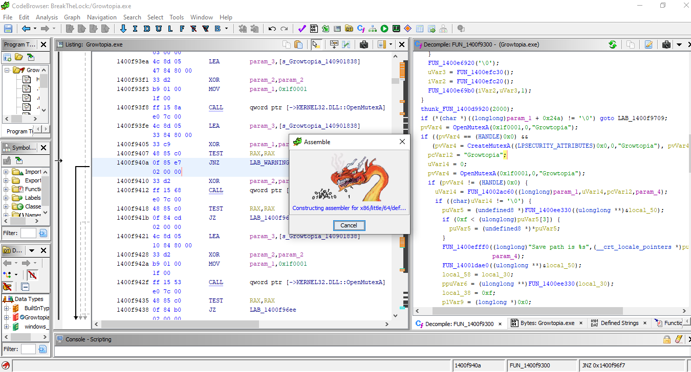
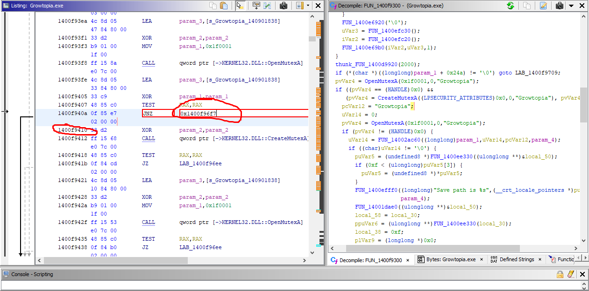
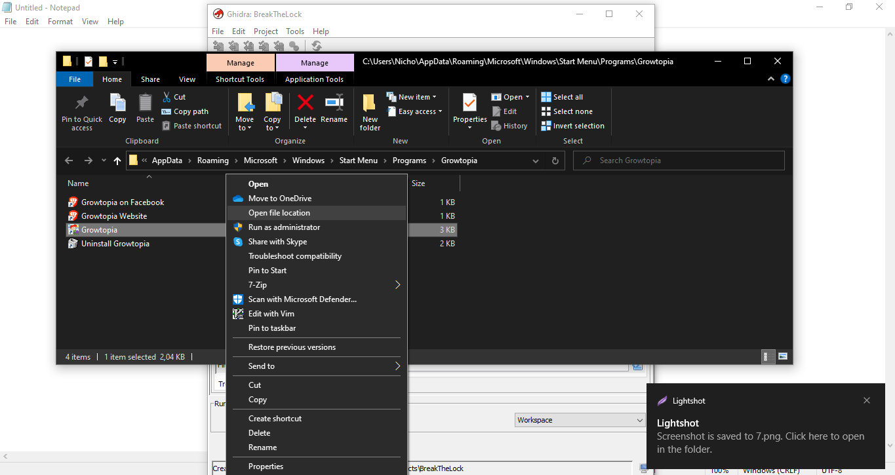
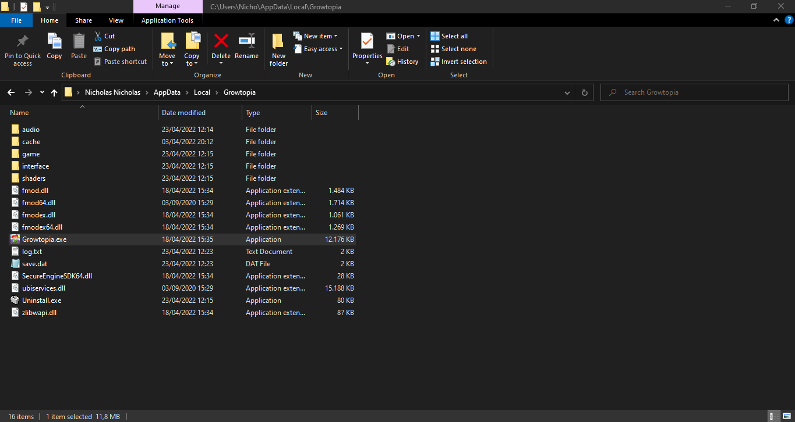
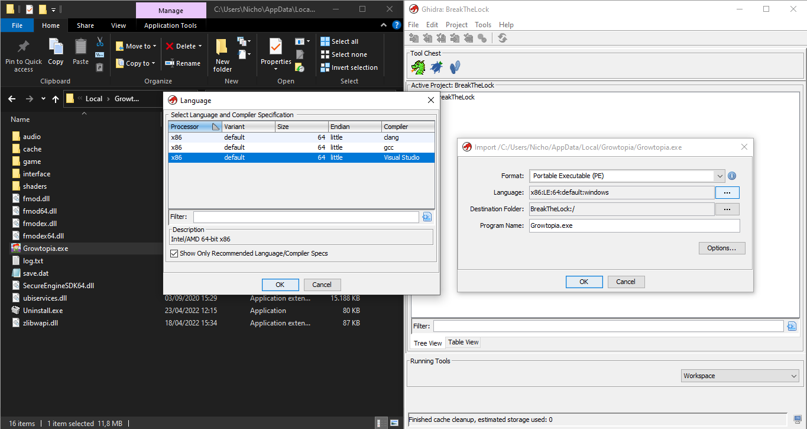
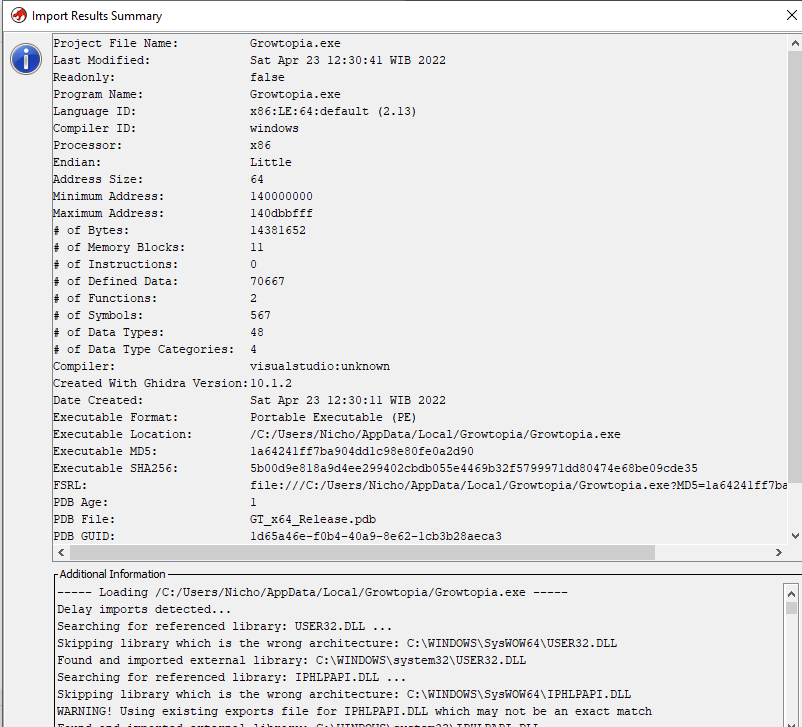
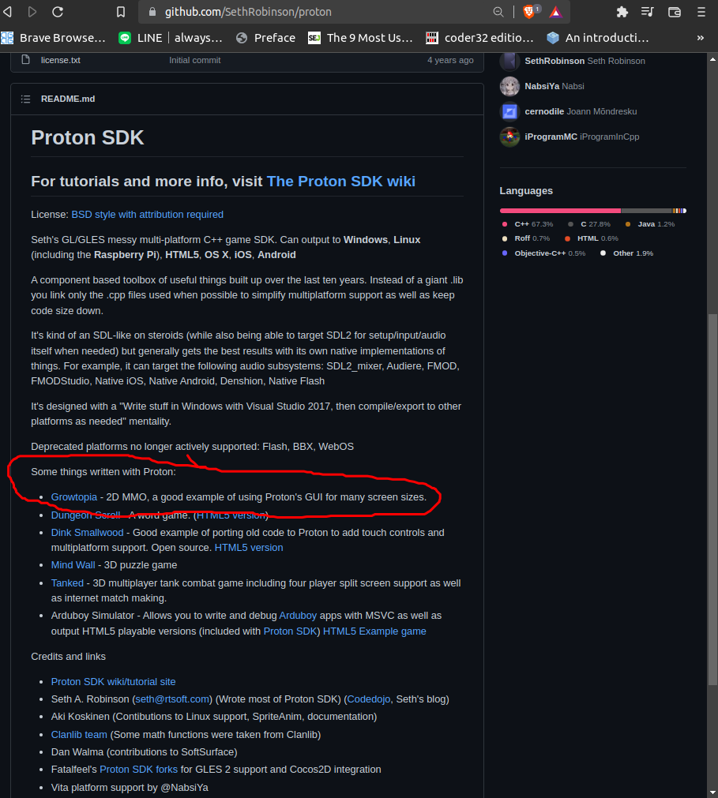

# Turtorial
In this tutorial I will show you how to reverse engineer a game(growtopia)
If you got 

# Why?
In the game you can't open a multiple instances of the game, so that you can't play with multiple
accounts on the same device, so lets try to ***reverse engineer*** the game to achieve this functionality


# Requirements
To understand/follow along this article things listed here is required
- basic knowledge of x86 assembly 
- some knowledge about how if else statements work at the low level
- experience in [C programming language](https://en.wikipedia.org/wiki/C_(programming_language))
- [ghidra](https://github.com/NationalSecurityAgency/ghidra) software - Windows OS


# Turtorials

## Turtorials Table Of contents
- [Overview](#1overview)
- [game and ghidra installation](#2game-and-ghidra-installation)
- [importing the game to ghidra](#3-importing-the-game-to-ghidra)
- [information gathering](#4-information-gathering)


```
Notes : 
this functions names that I mentioned in the article, in the microsoft docs or by the ghidra decompiler are the same and interexchangeable
I mention this because the microsoft docs and the output from the ghidra decompiler are different in naming both of this functions

OpenMutexW == OpenMutexA
CreateMutexW == CreateMutexA
```
## 1.Overview

In this tutorial we will try to break the validator as shown in [Why? Section](#why) using [reverse engineering](https://en.wikipedia.org/wiki/Reverse_engineering) techniques
with the [ghidra framework][ghidra_link]


A common way and easy way to check if a windows program is running with multiple instances is by using 
the win32 api [CreateMutexA][CreateMutexA_link] and [OpenMutexW][OpenMutexW_link], 


this is a pseudo code of how the program achieve this
```
  // if OpenMutexA fails because no mutex object has been prevously created 
  // then it will return NULL 
  // so to check if multiple instances are running, it can be done this way
  // which won't create new mutex if the mutex has been created previously
  program_handle = OpenMutexA(0x1f0001,0,"Growtopia");
  if ((program_handle == (HANDLE)0x0))
	program_handle = CreateMutexA((LPSECURITY_ATTRIBUTES)0x0,0,"Growtopia");

```

We can remove the lock by trying to make an unconditional jump by patching the binary at 
```
  if ((program_handle == (HANDLE)0x0))
```
with ghidra's disassembler to jump straight to 

```
program_handle = CreateMutexA((LPSECURITY_ATTRIBUTES)0x0,0,"Growtopia");
```
So that It will initialize the game regardless if a mutex for "Growtopia" has been created or not

### Example Of Patching Binary Via Modifying The Assembly 








after the "lock" has been **disabled**, we can play Growtopia on multiple windows with multiple accounts simultaneously


## 2.Game And Ghidra Installation
Before starting this tutorial, we need to install both of the game and ghidra

### ghidra installation
head over to [ghidra][ghidra_installation_link] and look at the [installation guide](https://htmlpreview.github.io/?https://github.com/NationalSecurityAgency/ghidra/blob/stable/GhidraDocs/InstallationGuide.html)

### growtopia installation

which can be installed [here][tutorial_resources] to install `SavedData.zip` then extract the zip to get the ***growtopia installer*** to install the game.

## 3. Importing the game to ghidra

1. open ***ghidra*** then go to ***file->New Project ...*** 

2. select ***Non-Shared Project*** then click next

3. now you need to specify the ***Project Directory*** and ***Project Name***
I will set my ***Project Directory*** as `C:\Users\Nicho\Desktop\cracking_blog\projects`
and my Project name as ***BreakTheLock***

4. After we have created the ghidra project we need to find the main ***executable*** of growtopia
- we can do that by first typing ***growtopia*** in the windows search bar


- we are brought to this folder, but it is only the location of the ***shortcut***
  so we need to right click at the shortcut once more and select ***open file location***



- we have sucessfully found the location of the main ***executable*** of growtopia



- import to ghidra by dragging the ***Growtopia.exe*** to the ghidra's project menu


- we are prompted this menu, we can just leave everything as default


	- we can also see the architecture of the executable by clicking the ***...*** besides ***Language*** menu

		- from the image above, we know that the game is compiled using [Visual Studio][visual_studio_link]  targeting the ***x86 architecture***

- after clicking ***ok*** we can begin importing the game to ghidra and wait until it finishes


- when the import is finished, we can see the ***summary/analysis*** of the binary

	- from the image above, we can see that ghidra seems to not know the specific visual studio's compiler
	  `Compiler: 			visualstudio:unknown`
	  (we need to find information about the specific compiler or what language the game is originally written in so that we can improve our reverse engineering effort)


## 4. Information gathering
Before we start ***reverse engineering*** the game, lets try to find the publicly available information about the game
like the source code's language the game written in, the library it uses and ect.

### finding the programming language the game is written in
Lets first try to find the github of the developers to guess the source code's language
to do that, we can head to the [wiki website of growtopia][growtopia_wikipedia_link]

>  Developed by Robinson Technologies and Hamumu Software until 2017.
>  Published by Robinson Technologies until 2017.


Looking at the page we can see that it is developed mainly by Robinson Technologies and Hamumu Software 

So lets try to find their github pages by searching for
```
robinson technologies github
```


when clicking the first result image we have found the [developer's github][rtsoft_github_link]


we can see from his github profile that he seems to like c++/c alot because he is using
it alot in his repositories

Now lets look at the first repositories that is shown which is [proton][proton_link]



We can see that growtopia is using the ***Proton SDK***, now we can conclude that it is likely
that growtopia on windows is written using ***c/c++*** and is using [winapi][win_api_wikipedia_link] to check for multiple instances
# Editing The article
this article is written in markdown, and to view the markdown some packages need to be installed 

## Setup
[python][python_link] and [pip][pip_link] needs to be installed on your system
### ubuntu
```
# install python  
sudo apt install python3 
# install pip 
apt-get install python3-pip
# install pip package to render markdown
pip install grip
```

## rendering the article
run `render.sh` to render the article (only needed once)


[//]: # (Common Links used by this article)
[ghidra_link]: https://github.com/NationalSecurityAgency/ghidra
[ghidra_installation_link]: https://ghidra-sre.org/
[CreateMutexA_link]: https://docs.microsoft.com/en-us/windows/win32/api/synchapi/nf-synchapi-createmutexa
[OpenMutexW_link]: https://docs.microsoft.com/en-us/windows/win32/api/synchapi/nf-synchapi-openmutexw
[pip_link]: https://pypi.org/project/pip/
[python_link]: https://www.python.org/
[tutorial_installer_link]: https://github.com/ShiromiTempest/growtopia_cracked/releases/tag/v.1.0.0

[growtopia_link]: https://www.growtopiagame.com/
[tutorial_resources]: https://github.com/ShiromiTempest/growtopia_cracked/releases/tag/v.1.0.0
[visual_studio_link]: https://visualstudio.microsoft.com/
[article_comments_section_link]: https://github.com/ShiromiTempest/growtopia_cracked/issues/1
[growtopia_wikipedia_link]: https://en.wikipedia.org/wiki/Growtopia
[rtsoft_github_link]: https://github.com/SethRobinson
[proton_link]: https://github.com/SethRobinson/proton
[win_api_wikipedia_link]: https://en.wikipedia.org/wiki/Windows_API
